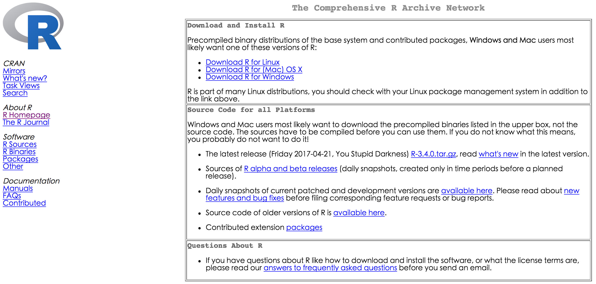
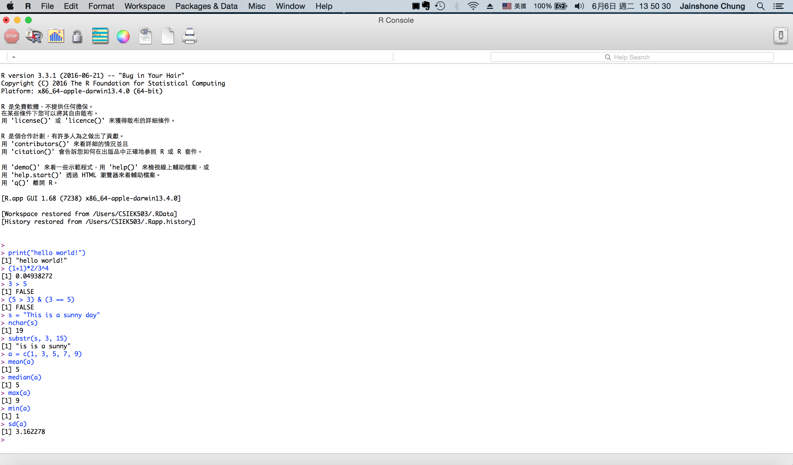
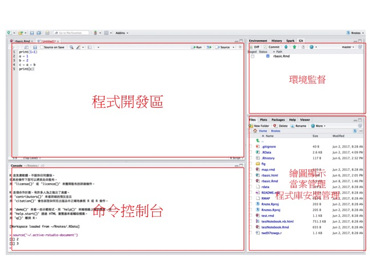

```{r setup, include=FALSE}
knitr::opts_chunk$set(echo = TRUE)
```

##1 R 基本介紹
1.1 R語言發展歷史
1.2 R語言的執行方式
1.3 R程式註解描述
1.4 線上求助

###1.1 R 語言簡介

R是一套開放式統計與資料分析工具，是一套專為統計計算所開發的專用程式語言，具有高執行效率。啟動 R 語言命令列介面，是一種互動式執行環境。另外，也可以將R所要做的工作寫成程式檔來執行，利用一般的程式編輯器就可以編輯 R 程式執行檔。目前常用的 R 語言程式開發環境有 R Studio 及 Jupyter 筆記本。R語言有龐大的使用者團體支持，協助開發很多有用的函式庫(Packages)，目前大約有有超過7800個實用的R語言函式庫可用。這些函式庫主要可協助使用者執行資料處理、資料視覺化、基本統計分析、以及高階的資料探勘與機器學期等應用。

R 語言工具的安裝非常簡單，可以到 R 語言專案官方網頁 (https://www.r-project.org/)，根據作業系統下載適當版本(download R)，目前最新的版本為 3.4.0。



###1.2 R語言的執行方式

R 語言工具提供互動式執行環境，點選桌面元件進入R互動式執行環境，可以在命令指示符號(>)執行R指令。


1. R控制台直接列印「Hello World」
2. 執行數字四則運算
3. 執行邏輯運算
4. 執行字串處理
5. 執行向量運算(建立向量、平均值、中數、最大/小值、變異數)

>註：(1+1)*2/3^4 = 2\*2/(3^4) = 2*2/81 = 4/81 = 0.04938272

另一種執行 R 的方式是下載 R-Studio 工具軟體，R-Studio 提供非常完整的 R 執行環境，包括編寫 R 程式，執行 R 命令的控制台，R 環境監督，以及繪圖顯示、檔案管理、與程式庫安裝管理區。

R 工具的一大特點是除了 R 的基本模組外，使用社群開發非常多的 R 語言程式應用模組，這些模組提供 R 語言使用強大能力，要使用這些程式模組，必須先經由`install.packages("packagename")`指令安裝，安裝時必須指定 R 儲存程式庫的伺服器(mirror server)。

###1.3 R 的基本運算

在 R 的命令操控台下可執行 R 的指令，如數字運算
```{}
> 1 + 1
[1] 2
> 5 / 5
[1] 1
> 1 + 1
[1] 2
> 3 / 5
[1] 0.6
> (3*8)/(2*3)
[1] 4
> log(10)
[1] 2.302585
> sqrt(121)
[1] 11
```
###1.4 R語言定義變數

```{}
> x = 10
> x
[1] 10
> class(x)
[1] "numeric"
```

利用`class(x)`可以知道x的資料類型為**數值**。

###1.5 R 基本資料類型
R語言提供5種基本資料類型，分別為numeric（數值）、Integer（整數）、Complex（複數）、 Logical（邏輯）、 Character（字元），例如

```{}
> x = 5
> class(x)
[1] "numeric"
> y = 3.14
> class(y)
[1] "numeric"
> z = FALSE
> class(z)
[1] "logical"
> w = "Hello World"
> class(w)
[1] "character"
```
`is.integer(x)`的執行結果顯示 x 是浮點數(numeric)而非整數，數值型（浮點數）資料可以利用`as.integer()`函數轉換為整數
```{}
> x = 5
> is.integer(x)
[1] FALSE
> u = as.integer(x)
> is.integer(u)
[1] TRUE
```
在以下運算中可以觀察到數值轉換成整數，同時`TRUE = 1`及`FALSE = 0｀。
```{}
> as.integer(3)
[1] 3
> as.integer(3.14)
[1] 3
> as.integer(TRUE)
[1] 1
> as.integer(FALSE)
[1] 0
```

R 提供邏輯判斷式`3 > 5 = False｀，邏輯判斷式的結果產生「True」或「False」，經由邏輯運算可產生較複雜的邏輯運算結果。
```{}
> 3 > 5
[1] FALSE
> 3 == 3
[1] TRUE
> 3 + 5 != 5
[1] TRUE
> (5>3) & (3>5)
[1] FALSE
> (TRUE) | (FALSE)
[1] TRUE
```

```{r}
t = TRUE
f = FALSE
t & f #AND
t | f #OR
!t #NOT
```

### 1.5 字串運算
```{r}
a = "jason"
b = "chung"
paste(a,b)
sprintf("Hello %s, Give me %d", "Jason", 5)
substr("This is a sunny day.", start=9, stop=19)
sub("sunny", "rainy", "This is a sunny day.")
```
##2.基本資料型別與變數定義
R語言提供5種基本資料類型，分別為

* numeric（數值）
* integer（整數）
* complex（複數）
* logical（邏輯）
* character（字元）

變數定義時不需要先宣告，直接指定變數內容即可。如


```{r}
x <- 5
y <- 3.14
z <- FALSE
w <- "Hello World"
```
可以利用R的函數`class()`來檢視資料的型別，如執行`class("Hello world")`的結果為字元(Character)。而執行`class(5)`的結果為數值(Numeric)，並非整數型別(Integer)，由此可知在R語言中，數值型資料型別預設為浮點數。
```{r}
class("Hello world")
class(5)
class(3.14)
```

可以利用`is.integer(5)`來檢視是否為整數，結果顯示`FALSE`。如果需要將5（預設為浮點數）轉換為整數，必須使用型別轉換函數，如`as.integer(5)`，經過轉換後的結果為整數型別。
```{r}
class(as.integer(5))
```
###型別轉換函數表

| 資料型別|  轉換函數    |     檢視函數  |
|:-------:|:------------:|:-------------:|
| 浮點數  | as.numeric() | is.numeric()  |
| 整數    | as.integer() | is.integer()  |
| 複數    | as.complex() | is.complex()  |
| 邏輯    | as.logical() | is.logical()  |


##3.基本運算式
###3.1數值運算
數值基本運算包括加、減、乘、除、次方、除法求商、除法求餘數。範例如下
```{r}
1+1
5-3
2*7
8/3
2^10
7%/%5
7%%5
```
R語言也提供基本運算函數，如求平方根、絕對值、指數函數、對數函數...
```{r}
sqrt(9)
abs(10)
abs(-10)
exp(5)
log(5)
log2(5)
log10(5)
log(5,2)
```

###3.2邏輯運算

##3.基本資料結構
R語言用來處理資料的基本資料結構有以下幾種

* 向量 (Vector)
* 矩陣 (Matrix)
* 列表 (List)
* 資料框 (Dataframe)

###3.1 向量(Vector)
R語言定義向量(vector)為一組有次序的同質資料


This is an R Markdown document. Markdown is a simple formatting syntax for authoring HTML, PDF, and MS Word documents. For more details on using R Markdown see <http://rmarkdown.rstudio.com>.

When you click the **Knit** button a document will be generated that includes both content as well as the output of any embedded R code chunks within the document. You can embed an R code chunk like this:

```{r cars}
summary(cars)
```

## Including Plots

You can also embed plots, for example:

```{r pressure, echo=FALSE}
plot(pressure)
```

Note that the `echo = FALSE` parameter was added to the code chunk to prevent printing of the R code that generated the plot.
